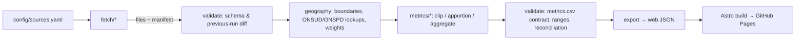

# Cholsey Parish Sustainability Dashboard — Technical Development Plan

| | |
| --- | --- |
| **Status** | Active. This is the baseline plan for all agent work on the project. |
| **Created** | 2026-09-27 |
| **Derived from** | [`technical-specification.md`](technical-specification.md), "the spec" |
| **Owner** | Project lead (Tom). Agents maintain it under the rules in §4. |

This plan turns the spec into phased, testable work. The spec says **what** to build and **why**. This plan says **how**, **in what order**, and **how we know each step is done**. If the two conflict, the spec wins and the conflict goes on the *Open questions* list in [`STATUS.md`](STATUS.md).

---

## Contents

1. [Guiding principles](#1-guiding-principles)
2. [Target architecture](#2-target-architecture)
3. [Phase plan](#3-phase-plan): Phase 0 to Phase 8
4. [Agent working protocol & documentation strategy](#4-agent-working-protocol--documentation-strategy)
5. [Testing strategy](#5-testing-strategy)
6. [Risks & open questions](#6-risks--open-questions)
7. [Glossary](#7-glossary)

---

## 1. Guiding principles

These come straight from the spec. Every phase is judged against them.

1. **Traceability is non-negotiable.** Every value keeps its provenance (source dataset, publisher, URL, vintage, retrieval date, geography actually used, method, flag) from ingestion through to the pixel on screen. A value without provenance is a bug.
2. **Never Cholsey alone.** Every comparison shows Cholsey, its comparator parishes, and a district and/or national reference together.
3. **Honest about uncertainty.** Estimates, apportionments and suppression fallbacks are flagged in the data and shown in the UI. Nothing is silently interpolated. "Current" always means *latest available year, labelled*.
4. **Fail loudly, keep last-known-good.** A schema change upstream stops the pipeline. It never corrupts published data.
5. **Zero running cost, low skill to maintain.** Static site, data built offline, one command to refresh, and a README a non-developer can follow.
6. **Small, reviewable increments.** Each phase, and ideally each work package, is a separate PR that leaves `main` working. Agents never attempt several phases in one pass.
7. **Reproducible.** Anyone with the repo and internet access can regenerate every published number from source with one command.

---

## 2. Target architecture

> The stack below is **proposed** in [ADR-0002](decisions/0002-tech-stack-and-repo-layout.md). It must be confirmed (status → *Accepted*) before Phase 0 closes. If the decision changes, update this section in the same PR.

### 2.1 Stack

| Concern | Choice (proposed) | Why |
| --- | --- | --- |
| Pipeline language | Python 3.12, managed with `uv` | Spec §7. geopandas ecosystem. `uv` gives a one-command, lock-filed environment. |
| Geo processing | `geopandas`, `shapely`, `pyogrio` | Clipping, area-weighting, spatial joins |
| Data validation | `pandera` schemas + custom contract checks | Declarative schema and range checks, readable failures |
| Pipeline tests | `pytest` with offline fixtures | CI never depends on government websites being up |
| Processed store | CSV (canonical, diff-able in PRs) plus generated JSON for the site | Spec §5: flat files in the repo. CSV diffs let a councillor *see* what changed in a refresh PR. |
| Front end | Astro (static output), TypeScript | Static-first HTML suits GitHub Pages. Markdown content collections let non-developers edit explainers. Minimal client JS. |
| Charts | Observable Plot (SVG) | Small, accessible SVG output, easy to pair with data-table fallbacks |
| Front-end tests | Vitest (unit), Playwright + `@axe-core/playwright` (e2e, a11y) | Automated provenance and accessibility gates |
| Hosting / CI | GitHub Pages + GitHub Actions | Spec §7. Free. |
| Task runner | `Makefile` (thin wrappers) | `make refresh`, `make test` and `make site` are the whole maintainer interface |

### 2.2 Repository layout (target)

```
.
├── CLAUDE.md                  # Agent entry point (read first, every session)
├── README.md                  # Human/maintainer entry point (Phase 8 makes it complete)
├── Makefile                   # refresh | test | site | lint
├── docs/
│   ├── technical-specification.md   # The spec (owner-edited only)
│   ├── development-plan.md          # This file
│   ├── STATUS.md                    # Live project state: phase, tasks, blockers, next steps
│   ├── decisions/                   # ADRs: NNNN-kebab-title.md + README index
│   └── worklog/                     # One entry per agent session: YYYY-MM-DD-slug.md
├── pipeline/
│   ├── pyproject.toml / uv.lock
│   ├── src/cholsey_pipeline/
│   │   ├── registry.py        # Loads config/sources.yaml
│   │   ├── fetch/             # One module per source (Phase 2)
│   │   ├── geography/         # Boundaries, lookups, apportionment weights (Phase 1, 3)
│   │   ├── metrics/           # One module per metric (Phase 3)
│   │   ├── validate/          # Schemas, contracts, previous-run diffing
│   │   └── export.py          # CSV → site JSON
│   └── tests/ (unit/, contract/, fixtures/)
├── config/
│   ├── sources.yaml           # Source registry: name, publisher, URL, licence, cadence, parser
│   ├── geography.yaml         # Area codes: Cholsey, comparators, district, national
│   └── metrics.yaml           # Metric definitions: id, label, unit, direction-of-good, ranges
├── data/
│   ├── raw/                   # Downloaded files (git-ignored, large)
│   ├── manifest/              # Committed: per-retrieval JSON (URL, sha256, bytes, retrieved_at)
│   ├── interim/               # Committed only if small: clipped extracts used for audit
│   └── processed/
│       ├── metrics.csv        # THE canonical table (§2.3)
│       └── geography/         # Simplified boundary GeoJSON for the site
├── content/                   # Explainers & opportunities (Markdown + front-matter), Phase 6
├── web/                       # Astro site; reads generated JSON from web/src/data/
└── .github/
    ├── workflows/ (ci.yml, deploy.yml, refresh.yml)
    └── pull_request_template.md
```

### 2.3 Canonical data model: `data/processed/metrics.csv`

One row per **(area_code, metric_id, year)**, as spec §5 requires. Provenance travels on the row.

| Column | Type | Example | Notes |
| --- | --- | --- | --- |
| `area_code` | str | `E04012474` | ONS GSS code |
| `area_name` | str | `Cholsey` | |
| `area_role` | enum | `subject` / `comparator` / `district` / `national` | Drives chart styling |
| `metric_id` | str | `elec_mean_kwh_per_meter` | Must exist in `config/metrics.yaml` |
| `year` | int | `2023` | The year the data **covers** (vintage) |
| `value` | float | `3412.7` | In `unit` |
| `unit` | str | `kWh/meter/year` | |
| `source_id` | str | `desnz_lsoa_elec` | Key into `config/sources.yaml` |
| `source_name` | str | `DESNZ Sub-national electricity consumption, LSOA` | Denormalised on purpose, so the row is self-describing |
| `source_publisher` | str | `DESNZ` | |
| `source_url` | str | `https://www.gov.uk/…` | Direct dataset URL |
| `retrieved_at` | date | `2026-10-04` | From the manifest |
| `raw_sha256` | str | `9f2c…` | Links the row to the exact file in `data/manifest/` |
| `geography_used` | str | `LSOA E01035751 (0.83), E01028619 (0.41)` | Actual input geographies with weights |
| `method` | enum | `direct` / `area_weighted` / `address_weighted` / `postcode_sum` / `clip` | |
| `flag` | enum | `none` / `parish_estimate` / `suppression_fallback` / `partial_coverage` | Shown in UI when not `none` |
| `flag_note` | str | `3 postcodes suppressed; LSOA estimate used` | Plain English, shown in tooltip |

Rules:
- No provenance column may be null. This is enforced by schema.
- `metrics.yaml` declares for each metric: `label`, `unit`, `direction` (`higher_is_better` / `lower_is_better` / `neutral`), `valid_range`, `max_yoy_change_pct`, `similar_band_pct` (the threshold for the "similar" tile colour), and `spec_ref`.
- `export.py` writes `web/src/data/metrics.json`, which is the same rows grouped by metric, plus `sources.json` and `areas.json`. The front end never computes provenance. It only displays it.

### 2.4 Pipeline flow



`make refresh` runs fetch → validate → metrics → validate → export. `make site` builds the site. If any validation fails, the run exits non-zero and nothing under `data/processed/` is overwritten. Outputs are written to a temp directory and moved into place atomically on success.

---

## 3. Phase plan

### 3.0 Overview

| Phase | Name | Spec phase | Main deliverable | Depends on |
| --- | --- | --- | --- | --- |
| 0 | Foundations & agent workflow | *(new)* | Tooling, CI, docs scaffolding, stack decision | none |
| 1 | Boundaries & geographic scope | 1 | Confirmed geography config + apportionment weights | 0 |
| 2 | Data ingestion | 2 | Fetchers, raw manifest, source contracts | 0, (1 for filtering) |
| 3 | Geographic join & metric table | 3 | `metrics.csv` with full provenance | 1, 2 |
| 4 | Front-end skeleton | 4 | Navigable site on placeholder data | 0 (can run parallel to 2–3) |
| 5 | Data wiring & charts | 5 | Real charts, provenance on every number | 3, 4 |
| 6 | Narrative & opportunities content | 6 | Council-reviewed copy per metric | 5 |
| 7 | Polish, accessibility & launch | 7 | Launch-ready public site | 5, 6 |
| 8 | Automated refresh & handover | 8 + spec §5/§7 automation | Monthly refresh PRs + maintainer README | 7 |

Phases 2 and 4 can run in parallel (for example, two agents on separate branches) once Phase 0 is done. All other dependencies are strict.

**Work package IDs.** Tasks are numbered `P<phase>.<n>` (for example `P2.3`). Use these IDs in `STATUS.md`, commit messages, PR titles and worklogs so work is traceable across sessions.

Every phase has these parts:
- **Goal**: one sentence.
- **Work packages**: individually PR-able tasks.
- **Key outcomes**: what is true when the phase is done.
- **Tests of success**: automated checks (which must be in CI) and manual acceptance checks (recorded in the worklog or PR).
- **Exit criteria**: a phase closes only when all of these hold and `STATUS.md` records it.

---

### Phase 0 — Foundations & agent workflow

**Goal:** a repo where any agent can land, orient itself in minutes, run the tests, and ship a small PR through green CI.

| ID | Work package |
| --- | --- |
| P0.1 | Agent documentation scaffolding: `CLAUDE.md`, `docs/STATUS.md`, `docs/decisions/` (ADR-0001, ADR-0002), `docs/worklog/`, PR template. *(Done in the planning session, 2026-09-27.)* |
| P0.2 | Confirm ADR-0002 (stack & layout) with the project lead and move it to *Accepted*, or supersede it |
| P0.3 | `pipeline/` Python project: `uv` + `pyproject.toml`, `ruff` (lint + format), `pytest`, package skeleton matching §2.2, `.gitignore` for `data/raw/` |
| P0.4 | `config/` skeletons: `sources.yaml`, `geography.yaml`, `metrics.yaml` with the schema documented inline, plus a loader and a validation test |
| P0.5 | `web/` Astro skeleton (TypeScript, one "hello" page), `npm` scripts `build`, `test`, `lint` |
| P0.6 | `Makefile` with `setup`, `test`, `lint`, `refresh` (stub), `site` |
| P0.7 | GitHub Actions `ci.yml`: lint and tests for pipeline and web on every PR. `deploy.yml`: build and publish to GitHub Pages from `main`. |
| P0.8 | Optional: Claude Code on the web `SessionStart` hook, so cloud agents get dependencies installed automatically |

**Key outcomes**
- One command (`make setup && make test`) works on a fresh clone.
- CI runs on every PR, and `main` is protected by it.
- An agent reading `CLAUDE.md` knows the reading order, rules and commands.
- The stack decision is recorded and accepted.

**Tests of success**
- *Automated:* CI is green on a PR that contains only the scaffolding. `pytest` runs at least one real test (config loader). `ruff check` and `ruff format --check` pass. `npm run build` produces `web/dist/index.html`.
- *Automated:* the config loader rejects a `metrics.yaml` entry missing `unit` or `direction`. There is a negative test for this.
- *Manual:* the placeholder site is reachable at the GitHub Pages URL.
- *Manual:* a fresh agent session given only "continue the project" correctly identifies the next work package from `STATUS.md`. This is a dry-run check of the documentation strategy.

**Exit criteria:** P0.1–P0.7 merged. ADR-0002 accepted. Pages URL recorded in `STATUS.md`.

---

### Phase 1 — Boundaries & geographic scope

**Goal:** the exact geography is pinned in version-controlled config and code: Cholsey, the confirmed comparators, district, and national. The weights needed to move every dataset onto parish polygons are computed reproducibly.

| ID | Work package |
| --- | --- |
| P1.1 | Fetch the ONS parish boundaries (Parishes Dec 2023 BFC for area/clip, BGC for display), LSOA 2021 boundaries, and ward boundaries of the vintage used by the canopy dataset (confirm the vintage in P1.1) |
| P1.2 | Verify the codes in spec §2 against ONS data: parish E04012474, ward E05011701, LSOAs E01035751/E01028619, MSOA E02005972, district E07000179. Record any discrepancy as an Open question and do not silently "fix" it. |
| P1.3 | Comparator selection: compute parishes whose polygons **touch** Cholsey. Compare with the spec's candidate list (Wallingford, Moulsford, South Stoke, Brightwell-cum-Sotwell, Aston Tirrold & Aston Upthorpe). Record the final list as an ADR and ask the project lead to confirm. |
| P1.4 | Complete the LSOA→parish overlap. Parish-to-LSOA membership is **not** assumed from the spec's two LSOAs. Derive it from ONS lookups (ONSUD UPRN→LSOA/parish, and OA→parish best-fit) and polygon intersection. |
| P1.5 | Apportionment weights. For every (parish, LSOA) pair, compute an **address-count weight**: the share of the LSOA's residential UPRNs that fall inside the parish, from ONSUD. Also compute an **area weight** as a cross-check. Do the same for (parish, ward) area weights for canopy. Output to `data/processed/geography/weights.csv` with provenance. |
| P1.6 | Parish denominators: 2021 Census population and dwelling/household counts for Cholsey and comparators (parish-level Census tables), plus mid-year estimates where available |
| P1.7 | `config/geography.yaml` finalised, plus simplified GeoJSON of the parish polygons for the site (Phase 5 map/locator) |

**Key outcomes**
- `config/geography.yaml` lists every area with GSS code, name, role and boundary vintage.
- `weights.csv` reproducibly maps each input geography (LSOA, ward, postcode) to parishes.
- The comparator list is confirmed and recorded in an ADR.

**Tests of success**
- *Automated:* Cholsey BFC polygon area is 16.52 km² ± 1%, the figure in spec §2. The test documents the source of the figure. (Superseded by Q-007, answered 2026-09-30: the live ONS BFC figure, ~15.91 km², is now authoritative for `config/geography.yaml`'s `area_km2` — the spec's 16.52 km² stays unchanged in the spec itself per CLAUDE.md, but is no longer what the config or the area-based calculations use.)
- *Automated:* for each LSOA, the address weights across all parishes it intersects sum to 1.0 ± 0.001. For each parish, the set of LSOAs with weight > 0 is non-empty.
- *Automated:* summed UPRNs across Cholsey's LSOA shares, reconciled against the ONSUD count of UPRNs with parish = E04012474, match exactly, because both derive from ONSUD.
- *Automated:* 2021 Census population for Cholsey equals 4,498, the figure in spec §2.
- *Automated:* every comparator touches the Cholsey polygon (or is explicitly whitelisted with a documented reason).
- *Manual:* a static PNG map of Cholsey, comparators and LSOA overlaps is rendered to `docs/assets/` and checked by eye. A reviewer confirms nothing obviously wrong, such as an LSOA entirely outside the parish having weight.

**Exit criteria:** all automated tests are in CI. The comparator ADR is accepted by the project lead. Code discrepancies (P1.2) are resolved or logged as Open questions with an agreed interim choice.

---

### Phase 2 — Data ingestion

**Goal:** a reliable, re-runnable fetch for every source that records exactly what was fetched and refuses to proceed when a source changes shape.

| ID | Work package |
| --- | --- |
| P2.1 | Source registry. `config/sources.yaml` gets one entry per dataset in spec §4, plus the ONS lookups from Phase 1: `id`, `name`, `publisher`, `landing_url`, `download_url` (or a discovery rule), `licence`, `attribution_text`, `cadence`, `geography`, `parser`. |
| P2.2 | Fetch framework: HTTP download with retries, sha256, byte size, `retrieved_at`, and a manifest entry in `data/manifest/<source_id>/<date>.json`. Skip the download if the upstream file is unchanged (ETag/Last-Modified/sha). Offline mode for tests. |
| P2.3 | Fetcher: **Forest Research UK Ward Canopy Cover** (Esri REST query filtered to the relevant wards, or the shapefile) |
| P2.4 | Fetcher: **OS Open Greenspace** (GeoPackage). Clip on ingest to a buffered bounding box around Cholsey and comparators to keep the interim extract small. |
| P2.5 | Fetcher: **DESNZ LSOA domestic electricity and gas**, all available years (for the 5–10 year trend), plus district and national totals from the same release |
| P2.6 | Fetcher: **DESNZ postcode-level electricity and gas**, latest years, filtered to OX10/relevant postcodes |
| P2.7 | Fetcher: **MCS installation data** (solar PV, heat pumps). Establish what is openly downloadable and at what geography. This is a known risk (§6). Document findings in an ADR before building. |
| P2.8 | Fetcher: **ONS population and dwellings** (if not fully covered in P1.6) |
| P2.9 | *Stretch:* **EPC register** (DLUHC). Needs registration and an API key via a GitHub secret. Build behind a feature flag, so the pipeline works without it. |
| P2.10 | Source contracts. For each source, a declared expected schema (columns, dtypes, key uniqueness) and a **previous-run diff**: row count change within a tolerance, no dropped columns, no new nulls in key fields. A contract failure is a hard stop with a readable message. |

**Key outcomes**
- `make fetch` pulls every source idempotently and writes a complete manifest.
- A silent upstream schema change fails loudly (spec §5).
- Every raw file can be traced by sha256 to a URL and retrieval date.

**Tests of success**
- *Automated:* each fetcher has a unit test against a small committed fixture (a real extract, trimmed), run offline in CI.
- *Automated (negative):* for each source, fixtures with a renamed column, a dropped column, and a row count −50% each cause the contract to fail with a non-zero exit and a message naming the source and column.
- *Automated:* running fetch twice against unchanged fixtures produces an identical manifest (idempotence) and no new files.
- *Automated:* every `sources.yaml` entry has a non-empty `licence` and `attribution_text`.
- *Manual:* one live run of `make fetch` against real sources succeeds. The manifest is committed and the run is summarised in the worklog (file sizes, years covered, anything surprising).

**Exit criteria:** fetchers for all six core sources are merged and live-verified once. Contract tests are in CI. The MCS data-access ADR is recorded. EPC is either done or explicitly deferred in `STATUS.md`.

---

### Phase 3 — Geographic join & metric table

**Goal:** produce `data/processed/metrics.csv`, with every metric for every area and every available year, fully provenanced, validated and reconciled.

| ID | Work package |
| --- | --- |
| P3.1 | `metrics.csv` schema (pandera) exactly as §2.3, including non-null provenance and enum checks |
| P3.2 | Metric 1, **tree canopy cover %**: ward canopy area apportioned to parish by area weight. If the ward is coterminous with the parish (check this), use `method=direct`. District and national from the same dataset. |
| P3.3 | Metric 2, **accessible green space**: OS Open Greenspace polygons clipped to the parish BFC. Output m²/resident (÷ population) and % of parish area. Decide in an ADR which greenspace function types count as "accessible". District and national equivalents are computed the same way, or flagged as unavailable. |
| P3.4 | Metrics 3 and 4, **domestic electricity and gas**: LSOA totals and meter counts apportioned by address weight, then mean = Σ consumption / Σ meters. Cross-check against a postcode-level sum. Where postcode suppression makes the postcode sum incomplete, use the LSOA estimate with `flag=parish_estimate` and a `flag_note` (spec §3). Output mean kWh/meter and total MWh, annual series. Electricity and gas stay as **two `metric_id`s** in the data model (different units, different sources), but the UI presents them together as one "Home energy" tile and detail page (Q-002 resolution, §6 below). |
| P3.5 | Metrics 5 and 6, **solar PV and heat pump uptake**: MCS installs mapped to parish (postcode→parish via ONSPD/ONSUD). Output count, % of dwellings, and installed kWp for PV. Annual cumulative series where install dates allow. |
| P3.6 | *Stretch:* Metric 7, **EPC band profile**: latest certificate per UPRN, % of dwellings by band. Flag `partial_coverage`, because not all dwellings have an EPC. |
| P3.7 | Benchmarks: district (E07000179) and national rows for every metric. **England** is the default national level (project lead decision, 2026-09-27); use GB/UK only where a dataset has no England-level figure, and record the level actually used in `area_name` and the provenance. |
| P3.8 | Validation and reconciliation suite (§5.2): ranges, year-on-year change limits, completeness matrix, district and national totals versus published figures |
| P3.9 | `export.py` writes the site JSON and a human-readable `data/processed/README.md` summary table (latest value per metric per area), regenerated each run |

**Key outcomes**
- One canonical, provenanced table covers 6 core metrics (plus the stretch metric) × Cholsey, comparators, district and national × all available years.
- Every number can be recomputed from raw files by code alone.

**Tests of success**
- *Automated (schema):* `metrics.csv` passes the schema. There are zero nulls in provenance columns. Every `metric_id` is in `metrics.yaml`, every `area_code` is in `geography.yaml`, and every `source_id` is in `sources.yaml`.
- *Automated (completeness):* for each core metric, every area has a latest-year value, or a row with `flag` explaining its absence. There are no silent gaps. A completeness matrix is printed in the test output.
- *Automated (ranges):* canopy and green space % are in [0, 100]. Mean domestic electricity is in [1,000, 10,000] kWh/meter, and gas in [3,000, 30,000]. Uptake % is in [0, 100]. Ranges come from `metrics.yaml`.
- *Automated (trend sanity):* year-on-year change is within `max_yoy_change_pct`. A breach fails, unless an allow-list entry with a reason is committed.
- *Automated (reconciliation):* district-level values computed by our pipeline match the publisher's own district figure within 0.5% where the publisher provides one (DESNZ does). Summed apportioned meter counts across all parishes in the district match the district total within 1%.
- *Automated (golden values):* for Cholsey's latest year, a hand-computed value per metric (worked through in a notebook or spreadsheet and committed under `pipeline/tests/golden/`) equals the pipeline value.
- *Manual:* the project lead reviews `data/processed/README.md` for plausibility ("does Cholsey having X heat pumps sound right?"). Sign-off is recorded in the worklog.

**Exit criteria:** all core metrics are produced and pass every automated check in CI. Method ADRs exist for green space accessibility and suppression fallback. Plausibility is signed off.

---

### Phase 4 — Front-end skeleton

**Goal:** a navigable, unstyled but structurally complete site with all four page types from spec §6, driven by placeholder data **in the real JSON shape**.

| ID | Work package |
| --- | --- |
| P4.1 | Placeholder `metrics.json`, `sources.json` and `areas.json` generated from the **same schema** as §2.3 (a fixture generator in the pipeline, so the shapes cannot drift) |
| P4.2 | TypeScript types for the JSON, generated from or checked against the pipeline schema |
| P4.3 | Layout: header, nav, footer (with an OGL attribution placeholder), skip link, landmarks |
| P4.4 | Home page: narrative summary slot and **five** headline tiles (canopy, green space, home energy [combined electricity + gas], solar PV, heat pump), each with value, year label, sparkline slot and comparison indicator slot |
| P4.5 | Metric detail page template: one page per tile from P4.4, generated from `metrics.yaml`. The "Home energy" page carries two metrics (electricity and gas) side by side, each with its own trend chart, comparator bar and provenance; other pages carry one. Each page has a "What this means" slot and an "Opportunities" slot. |
| P4.6 | Comparison page: pick one comparator and see all metrics side by side (a table is the baseline; radar chart is optional) |
| P4.7 | Methodology / sources page, generated from `sources.json` |
| P4.8 | A `<Provenance>` component that renders the source, geography, year, method and flag for a given row. Used everywhere a number appears, from day one. |

**Key outcomes**
- Every route from spec §6 exists and is reachable from the nav.
- The site consumes data only through typed loaders and the `<Provenance>` component.

**Tests of success**
- *Automated:* `npm run build` succeeds with zero type errors. Vitest covers data loaders and the formatting helpers (units, thousands separators, year labels).
- *Automated (Playwright):* visits `/`, each `/metrics/<id>`, `/compare`, and `/methodology`. Each returns 200, has one `<h1>`, and has no console errors.
- *Automated:* the contract test fails the build if placeholder JSON does not validate against the pipeline schema.
- *Manual:* navigate the whole site at 360 px and 1280 px widths. Screenshots are attached to the PR.

**Exit criteria:** all four page types are merged, with Playwright smoke tests in CI and a Pages deploy of the skeleton.

---

### Phase 5 — Data wiring & charts

**Goal:** real data drives every tile and chart, with provenance on every number and the three-reference-points rule enforced.

| ID | Work package |
| --- | --- |
| P5.1 | Swap placeholder JSON for the pipeline export (build reads `web/src/data/`, produced by `make refresh`) |
| P5.2 | Home tiles: latest value with **explicit "latest available: YYYY" label**, sparkline (Cholsey series), and a better/similar/worse indicator versus district and national using `direction` and `similar_band_pct` from `metrics.yaml`. The indicator must never rely on colour alone (icon plus text). |
| P5.3 | Trend line chart: Cholsey vs comparators vs national, multi-year, with Cholsey visually emphasised and others muted |
| P5.4 | Latest-year bar chart: Cholsey vs each named comparator, with district and national reference lines |
| P5.5 | Comparison page populated. `metrics.yaml` direction drives the "better" highlighting. |
| P5.6 | Provenance on interaction: hover/focus/tap on any value, bar or point shows `<Provenance>`. Keyboard accessible. Flags (for example "parish estimate") are shown inline, not only in the tooltip. |
| P5.7 | Accessible data fallbacks: every chart has a visually hidden or expandable data table plus a text summary |
| P5.8 | Auto-generated narrative summary sentence(s) on the home page from the data (template-based, deterministic) |

**Key outcomes**
- The dashboard tells the spec's four-part story (stands / compares / trending / act) with real numbers.
- The spec's hard requirement holds: **every number on the page exposes its source, geography level and year**.

**Tests of success**
- *Automated (provenance gate, the key test):* Playwright walks every page. For every element marked `data-value`, it asserts that an associated provenance element exists and contains non-empty `source`, `geography` and `year`. Zero exceptions are allowed.
- *Automated (three-points rule):* every trend and bar chart's rendered series set includes Cholsey, at least one comparator, and a district or national reference.
- *Automated:* tile "latest year" labels equal max(year) for that metric and area in the data, not the current calendar year.
- *Automated:* narrative template unit tests cover better, similar and worse cases, plus missing data.
- *Automated:* a changed value in the JSON fixture shows up on the page. This end-to-end test proves there are no hard-coded numbers.
- *Manual:* three random numbers on the live preview are traced by hand via their tooltips back to the source URL and the matching row in `metrics.csv`. The trace is recorded in the PR.

**Exit criteria:** all charts are live on real data. The provenance gate and the three-points test are in CI and passing.

---

### Phase 6 — Narrative & opportunities content

**Goal:** plain-English explainers and 2–4 concrete, locally relevant actions per metric, editable by non-developers and reviewed by the parish council.

| ID | Work package |
| --- | --- |
| P6.1 | Content model: `content/metrics/<metric_id>.md` with front-matter (`what_this_means`, `opportunities: [{title, description, url, provider, last_checked}]`). The site renders from it. |
| P6.2 | Draft "What this means" copy per metric. Aim for a reading age of about 12 and no unexplained jargon. |
| P6.3 | Research and draft 2–4 opportunities per metric, with real, current, local or national schemes (spec examples: Forestry England tree schemes, Oxfordshire retrofit advice). Each has a URL and a `last_checked` date. |
| P6.4 | Glossary and "about this dashboard" page |
| P6.5 | **(Deferred to the Phase 7 launch gate, ADR-0016.)** Council review loop: export the drafts (PDF or doc) and record the feedback and approval date in the worklog. Content is marked `status: approved` in front-matter only after review. |

**Key outcomes**
- Every metric page has approved explainer and opportunity content.
- A non-developer can edit the copy through a GitHub web edit of a Markdown file.

**Tests of success**
- *Automated:* a schema check that each core metric has a content file, 2–4 opportunities, and a valid URL and `last_checked` on each.
- *Automated:* a link checker (for example `lychee`) over built pages runs in CI, with a weekly scheduled run so link rot is caught after launch.
- *Automated:* readability score (Flesch reading ease ≥ 60) reported per content file. This is a warning, not a failure.
- *Manual:* parish council sign-off is recorded, with date and approver, in the worklog and in the front-matter `status: approved`.

**Exit criteria:** all core metrics have approved content. The link checker is green.

---

### Phase 7 — Polish, accessibility & launch

**Goal:** a launch-ready, accessible, mobile-first public site.

| ID | Work package |
| --- | --- |
| P7.1 | Visual design pass: typography, colour tokens, consistent chart palette (colour-blind safe), print styles for council papers |
| P7.2 | Mobile pass: tiles, charts and tooltips usable at 360 px. Tap targets ≥ 44 px. |
| P7.3 | WCAG 2.1 AA pass: contrast, focus order, focus visible, reduced motion, chart alternatives, language attribute, headings |
| P7.4 | Methodology page completed. It is auto-generated from `sources.yaml` and the method ADRs, plus narrative on apportionment and suppression. |
| P7.5 | Footer: OGL v3.0 attribution plus per-source attribution text, "data last refreshed" date, and a link to the repo |
| P7.6 | Performance and SEO: meta tags, social card, sitemap, and a page weight budget |
| P7.7 | Custom domain (optional, owner decision) and launch checklist |
| P7.8 | Content approval (carried over from P6.5, ADR-0016): the council reviewer ("S") reviews `docs/content-review-pack.md`; feedback is applied; `status: approved`, `reviewed_by` (role) and `reviewed_on` are set in every `content/` file, which removes the draft notices. Launch checklist item: the URL is not shared until this is done. |

**Key outcomes:** the site is fit to be shown at a parish council meeting on a phone and cited in a grant bid.

**Tests of success**
- *Automated:* axe-core (Playwright) finds **zero serious or critical** violations on every page. Lighthouse CI scores accessibility ≥ 95, best practices ≥ 95 and performance ≥ 90 (mobile preset) on home and one metric page.
- *Automated:* no horizontal scroll at 360 px on any page (Playwright viewport check).
- *Automated:* the footer contains the OGL text and every `attribution_text` from `sources.yaml`.
- *Automated:* page weight for home is under 500 KB transferred (excluding fonts, if any).
- *Manual:* a keyboard-only walk-through of every page. A screen-reader spot check (VoiceOver or NVDA) on home and one metric page. Real-phone check on iOS Safari and Android Chrome.
- *Manual:* the project lead gives launch sign-off.

**Exit criteria:** all automated gates are green, manual checks are recorded, and launch is signed off. The URL is published.

---

### Phase 8 — Automated refresh & handover

**Goal:** routine yearly updates need no developer. A monthly job proposes data updates as PRs, and a non-technical maintainer can review, merge, or run a refresh by hand.

| ID | Work package |
| --- | --- |
| P8.1 | `refresh.yml` GitHub Action on a monthly cron plus manual dispatch. It runs `make refresh`. If any `raw_sha256` changed and all validation passes, it opens a PR with the new `metrics.csv`, manifest and site JSON. It **never auto-merges** (spec §7). |
| P8.2 | Refresh PR body is generated automatically: which sources changed, new years added, the biggest value changes per metric (a table), and any flags added or removed. Written for a councillor, not a developer. |
| P8.3 | Failure path: if validation fails, no PR is opened. Instead, open or update a single GitHub issue labelled `data-refresh-failed` with the error summary. The live site keeps its last known-good data. |
| P8.4 | Maintainer `README.md`: what the dashboard is, how data flows, "how to review and merge a refresh PR" (with screenshots), how to run `make refresh` locally, what to do when the refresh issue appears, how to edit content, and who to ask |
| P8.5 | Runbooks in `docs/runbooks/`: new DESNZ year, boundary change (new parish or LSOA vintage), adding a comparator, adding a metric |
| P8.6 | Handover rehearsal: a non-developer follows the README to review and merge a real or simulated refresh PR |

**Key outcomes**
- Routine updates arrive as reviewable PRs with a plain-English summary.
- Failures are visible and safe.
- The project survives the original builders leaving.

**Tests of success**
- *Automated:* workflow tests run via manual dispatch against fixture "upstream" states:
  1. Unchanged sources: the job succeeds and **no PR** is opened.
  2. A new year appears in the DESNZ fixture: **one PR** is opened, containing the new rows and a summary that mentions the new year.
  3. A broken schema: **no PR**, the `data-refresh-failed` issue is opened, and `main` is untouched.
- *Automated:* `make refresh` on a fresh clone with network access completes end to end, as a scheduled CI smoke run.
- *Manual:* the handover rehearsal is done by a non-developer (named in the worklog) without developer help. Friction points are fixed in the README.

**Exit criteria:** all three workflow scenarios are demonstrated, the handover rehearsal is complete, and the README is final. The project moves to *maintenance* in `STATUS.md`.

---

## 4. Agent working protocol & documentation strategy

This section is the contract every agent (and human contributor) follows. Its purpose is that **any agent can pick up the project cold, understand exactly where it stands, and leave it in a state the next agent can pick up**. The rationale is recorded in [ADR-0001](decisions/0001-record-decisions-and-agent-documentation.md).

### 4.1 The documentation set: what lives where

| File | Answers | Updated when | Style |
| --- | --- | --- | --- |
| `CLAUDE.md` (root) | "How do I work in this repo?" Reading order, rules, commands. | Commands, layout or rules change | Short and stable. Pointers, not content. |
| `docs/technical-specification.md` | "What are we building and why?" | Only by the project lead | Owner document. Agents never edit it. |
| `docs/development-plan.md` | "How, in what order, and how do we know it's done?" | Scope or phase structure changes, **via an ADR** | Baseline plan |
| `docs/STATUS.md` | "Where are we right now, and what's next?" | **End of every session** (mandatory) and whenever a task changes state | Live dashboard. Overwritten, not appended. |
| `docs/decisions/NNNN-*.md` | "Why is it like this?" | Whenever a significant decision is made | Immutable once accepted. Superseded, never rewritten. |
| `docs/worklog/YYYY-MM-DD-slug.md` | "What happened in that session?" | **One new file per session** (mandatory) | Append-only history |
| `docs/runbooks/*.md` | "How do I do recurring operation X?" | Created in Phase 8, or earlier when useful | Step-by-step |
| PR description | "What does this change do and how was it verified?" | Every PR | Uses `.github/pull_request_template.md` |

The rule of thumb:
- **STATUS** holds the *present*.
- **Worklog** holds the *past*.
- **ADRs** hold the *reasons*.
- **Plan** holds the *future*.
- **Spec** holds the *intent*.

Don't duplicate across them. Link instead.

### 4.2 Session protocol

**At session start (orient):**
1. Read `CLAUDE.md`, then `docs/STATUS.md`.
2. Read the most recent 1–3 worklog entries (`ls docs/worklog | tail -3`).
3. Read the plan section for the current phase, and any ADRs linked from `STATUS.md` for the task at hand.
4. Check `git log --oneline -15` and open PRs to confirm `STATUS.md` isn't stale. If it is stale, fix it first and note that in the worklog.
5. Pick work: take the **first unblocked task in the current phase marked `todo`** unless the user directs otherwise. Mark it `in-progress` in `STATUS.md` with the branch name.

**During the session (record as you go):**
- **Decisions.** If you choose between real alternatives that a future agent might question or undo (a method, a library, a threshold, a data interpretation, a deviation from spec or plan), write an ADR *in the same PR* as the code. When in doubt, write it, because ADRs are cheap. Trivial local choices (a variable name, a helper split) don't need one.
- **Questions for the project lead.** Anything that needs a human (ambiguity in the spec, confirming comparators, content sign-off) goes under *Open questions* in `STATUS.md` with an ID (`Q-007`), date and context. If work can proceed on an assumption, state the assumption there and in the code or ADR, and continue. If it can't, mark the task `blocked` and move to another task.
- **Discovered work.** New tasks found along the way are added to `STATUS.md` under the right phase with a new `P<phase>.<n>` ID (append; never renumber existing IDs). If one doesn't fit any phase, add it to *Backlog / unscheduled*.
- **Deviations from the plan.** Minor ones (task order, splitting a task) are fine and go in the worklog. Material ones (changing a phase's outcomes or tests, dropping scope, changing the stack) need an ADR and an update to this plan in the same PR.

**At session end (hand off). This is mandatory even if the work is incomplete:**
1. Update `docs/STATUS.md`: task states, *Current focus*, *Next steps* (concrete, ordered, first item actionable by a cold-start agent), blockers, open questions, and the *Last updated* line.
2. Write `docs/worklog/YYYY-MM-DD-<slug>.md` from the template in `docs/worklog/README.md`: goal, what was done (with task IDs), decisions (ADR links), tests run and results (real output summary, not "tests pass" without evidence), what's unfinished, and handoff notes.
3. Commit the docs **with** the code they describe, in the same commit or PR, so history stays consistent.
4. If a phase's exit criteria are all met, mark the phase `done` in `STATUS.md` with the date and evidence links, and set the next phase as current.

### 4.3 Status vocabulary

Task states in `STATUS.md`:

| State | Meaning |
| --- | --- |
| `todo` | Not started |
| `in-progress` | Being worked on. Include the branch name. |
| `review` | PR open. Include the PR link. |
| `blocked` | Can't proceed. Name the blocker (for example `Q-003`). |
| `done` | Merged to `main` |
| `deferred` | Consciously postponed. Include the reason or ADR. |

Phase states are `not-started`, `active`, `done` (with date) and `maintenance`.

Open-question states (see §4.7): `open`, `answered`, `awaiting confirmation`, `actioned`.

### 4.4 Decision records (ADRs)

- Location: `docs/decisions/NNNN-kebab-case-title.md`, numbered sequentially and zero-padded. Add each one to the index in `docs/decisions/README.md`.
- Template (in `docs/decisions/README.md`): **Status** (Proposed / Accepted / Superseded by NNNN / Rejected), **Date**, **Context**, **Options considered**, **Decision**, **Consequences**, **Related** (task IDs, spec sections).
- An agent may **accept** its own ADR when the decision is technical, reversible and within the plan. Decisions that change user-visible scope, the stack, comparators, or anything the spec states are left **Proposed** and raised as an Open question for the project lead.
- Never edit an accepted ADR's decision. Write a new ADR that supersedes it and update the old one's status line only.

### 4.5 Git, branches and PRs

**`main` is the sole working branch, and the sole authority for `STATUS.md`.** (This wasn't always true: Phase 0 and Phase 1 developed on a session-specific "designated branch", `claude/new-session-7bcxu1`, with `main` only receiving finished phases via PR. That split was retired in the cutover immediately after Phase 1's PR merged, 2026-09-29 — see the Transition note below for the full history, kept for context.) `STATUS.md`/worklog commits for documentation-only changes (a correction, an open-question answer being actioned, a worklog entry with no code) go **directly to `main`**, same as always. Code for project work (`P<phase>.<n>` tasks) goes through one PR per phase, per Tom's direction, 2026-09-28 (Q-006).

**At the start of a phase:**

1. Branch off `main`'s tip: `phase-<N>-<short-slug>` (e.g. `phase-2-data-ingestion`). (Historical note: Phase 1's phase branch was named `claude/new-session-7bcxu1-phase-1-remainder`, forked from the now-retired designated branch — a hyphen before `phase`, not a slash, because a slash makes an invalid git ref alongside a branch that is its own strict prefix. That constraint no longer applies to plain `phase-<N>-<slug>` names forked from `main`, but keep it in mind if a similarly nested naming scheme is ever proposed again.)
2. Every work package's code commits land on this phase branch, pushed after each one (don't let uncommitted work sit only in a container between routine firings). Tests and lint must be clean locally (`make test`, `make lint`) before each push, same as always. Commit titles still start with the task ID: `P2.5: DESNZ LSOA fetcher with contract tests`.
3. `STATUS.md`/worklog updates happen every session as usual (§4.2), but go **directly to `main`**, not the phase branch — check out `main`, commit the docs, push, then switch back to the phase branch to continue the code work. This is the one place code and docs deliberately go to different branches; it's what keeps `STATUS.md` live and truthful while a multi-session phase is still in progress. Use the task-state vocabulary already built for this: a work package in flight is `in-progress` with the phase branch name noted (§4.3).
4. **Once every work package in the phase is done** (or as many as can be — a work package genuinely blocked on an unanswered `Q-NNN` doesn't have to hold up the rest, same as any other blocker), push the phase branch and open one PR: **base = `main`**, head = the phase branch. Use the PR template: summary, every task ID the phase covered, how it was verified, docs-updated checkboxes. Set every covered task's `STATUS.md` row to `review` with the PR link.
5. Wait for the real GitHub Actions run on the PR to finish (poll `actions_list`/`actions_get` — don't just trust the local runs, even though they mirror CI's commands exactly; a run that fails there is real and blocks the merge below). If it's red, fix it on the phase branch and re-push, same as any other CI failure (development-plan.md §5 / the repo's own PR-driving rules).
6. **Once CI is green, spawn a review subagent**: an `Agent` call with `model: "opus"`, instructed to run the `code-review` skill against the PR at `high` effort (a phase-sized diff is bigger than a single work package's — broader coverage is worth the extra cost here, which is exactly why this review happens once per phase rather than on every small PR) with `--comment` (so findings land as real inline PR comments, not just a chat summary), then report back a structured verdict (blocking findings / optional findings / clean). Run it in the foreground — the next step depends on its result.
7. **Blocking (correctness) findings**: fix them on the phase branch, push, and re-run the review (step 6) — at most 2 review cycles before treating it as `blocked` (log a `Q-NNN` per §4.7 rather than looping indefinitely or merging with a known bug; given the diff is a whole phase, use judgement about whether the finding blocks the *whole* PR or can be split into a small immediate follow-up commit on the same branch). Optional/nit findings: use your own judgement per the usual rule (fix if trivial and correct, otherwise leave a one-line reply on the thread and move on) — they don't gate the merge.
8. **Once CI is green and there are no unresolved blocking findings, merge the PR into `main` yourself** (squash or merge commit — squash is usually cleaner for a single phase branch with many small work-package commits; merge commit if the individual commit history is worth preserving — use judgement; delete the phase branch after). This was Tom's explicit call, 2026-09-28: the review plus passing tests are the quality gate, not a wait for a human to click merge — the project should keep moving unattended. This merge is also what makes `deploy.yml` actually publish the real site (it triggers on push to `main`) — check the Pages deploy went out (and see Q-010 in STATUS.md: as of Phase 1's merge, the site is still being served by the legacy "Deploy from a branch" Pages source, not the new Actions-based `deploy.yml`, despite that source setting reportedly already being switched — needs Tom to re-check). Then mark the phase `done` in `STATUS.md`'s Phase overview per §4.6, and open the next phase's branch directly off `main`'s tip.
9. If the review subagent itself fails to run, or GitHub Actions can't be reached, don't silently skip the gate and merge anyway — treat it the same as any other blocker per CLAUDE.md (log it, and if it can't be worked around, leave the PR open rather than merging unreviewed).
10. **Important lesson from Phase 1's cutover**: a phase branch does NOT automatically pick up documentation-only commits made to `main`/the designated branch after the phase branch was forked (they're on a different branch!). Before merging a phase's PR, check whether `main` has moved (docs-only commits, or another phase's merge) since the phase branch was forked, and if so, merge `main` into the phase branch (or merge `main`'s current tip into the phase branch right after this PR merges) so nothing gets silently dropped — Phase 1's own PR merge initially left `main`'s `STATUS.md`/`development-plan.md`/`CLAUDE.md` several commits stale until this was caught and fixed with a follow-up merge.

**Transition note (Phase 1, historical):** P1.1 through P1.4 were already committed and pushed directly to the (then-existing) designated branch, before this PR workflow existed in any of its shapes — they are not retroactively un-merged or re-reviewed. Phase 1's phase branch (forked from the designated branch's tip, so it carried Phase 0 and P1.1-P1.4 too) and its PR into `main` was therefore the **first** time any of this project's work reached `main` — that one PR covered everything through the end of Phase 1, not just P1.5 onward. Immediately after that merge (2026-09-29), the designated-branch/`main` split was retired: `main` became, and remains, the sole working branch. Every phase from Phase 2 on is a clean, phase-only diff into `main`, forked from `main`, from its first commit.

Generated data (`data/processed/`, `web/src/data/`) is committed only by `make refresh` output, never hand-edited, same as before.

### 4.6 Keeping the docs healthy

- `STATUS.md` should stay under about 200 lines. Move `done` phases' task tables into a collapsed *Completed phases* summary with links to worklogs.
- The worklog is never edited retrospectively except to fix factual errors, and such fixes are marked as edits.
- If `CLAUDE.md` and this plan disagree, the plan wins. Fix `CLAUDE.md`.
- At the end of each phase, the closing agent does a quick doc audit: stale Next steps, resolved Open questions still listed, ADRs still marked Proposed that have actually been decided.

### 4.7 Open questions: the answer / action-tracking loop

An open question isn't finished when Tom answers it — it's finished when an agent has actually *acted* on that answer. A question sitting "answered" in the file with nobody having read it yet is a silent failure this protocol exists to prevent, especially since this project runs unattended for long stretches between a human looking at it.

`docs/STATUS.md`'s *Open questions* table has six columns: **ID**, **Raised**, **Question**, **Tom's answer**, **Status**, **Blocks**. The status values:

| Status | Set by | Meaning |
| --- | --- | --- |
| `open` | the agent that raised it | No answer yet. An agent may proceed on its own stated working assumption if it recorded one, but the question stays open regardless. |
| `answered` | Tom (or whoever fills in the answer) | An answer is written in **Tom's answer**, but no agent has acted on it yet. **First-priority work** — see below. |
| `awaiting confirmation` | the agent, after acting | The agent did everything it could from the repo, but the row asked for something only Tom can do or confirm outside it (a GitHub setting, a real-world fact, sign-off). Waiting on Tom to say it's done. |
| `actioned` | the agent, once truly done | Fully resolved: either the agent incorporated the answer into the code/config/docs, or Tom confirmed an `awaiting confirmation` step is complete. |

**Tom's side is deliberately one step**: write the answer in that cell. He never has to touch Status himself — an agent moves it from `open` to `answered` is not even necessary (Tom writing a non-empty answer *is* the `answered` signal; an agent should treat a row with a filled-in answer and status still `open` exactly as if it already said `answered`, and set it explicitly on the next visit so it's unambiguous for whoever looks at the file next).

**Every session's start-of-session read of `STATUS.md` (§4.2 step 1) includes scanning this table.** Any row with a non-empty answer and status `open` or `answered` is handled *before* picking up the next queued task, even mid-phase, even routine-fired — it is a person actively waiting, which outranks the task queue. "Handling" it means: read the answer, do whatever it implies (a code change, a config change, an ADR, or simply proceeding past whatever it blocked), record what was done in the **Actioned as** detail (in the row itself or, if that makes the table too wide, in the worklog entry the row then links to), and set Status to `actioned` (or `awaiting confirmation` if the answer asks Tom to do something outside the repo). Never leave a row `answered` at the end of a session — if it genuinely can't be actioned yet (needs a task not yet reached), say why in the row and leave it `open` with the reason, not `answered` sitting untouched.

At the next doc audit (§4.6), move rows that are `actioned` (or `awaiting confirmation` and since confirmed) into the *Answered / closed questions* collapsed section, in the same style as `<details>`-collapsed completed phases, so the live table stays short and only ever shows what's actually pending.

---

## 5. Testing strategy

### 5.1 Test layers

| Layer | Tooling | Runs | Purpose |
| --- | --- | --- | --- |
| Config validation | pytest | every PR | Registry, geography and metrics YAML are well-formed and cross-consistent |
| Unit (pipeline) | pytest + fixtures | every PR | Parsers, apportionment maths, metric formulas |
| Source contracts | pytest + pandera | every PR (fixtures); every refresh (live) | Detect upstream schema drift |
| Output contract | pandera on `metrics.csv` | every PR, every refresh | Schema, non-null provenance, enums, referential integrity |
| Data quality | pytest | every PR, every refresh | Ranges, YoY limits, completeness, reconciliation, golden values |
| Front-end unit | Vitest | every PR | Loaders, formatters, narrative templates, indicator logic |
| E2E | Playwright | every PR | Routes, provenance gate, three-points rule, no hard-coded numbers |
| Accessibility | axe-core + Lighthouse CI | every PR (Phase 7 onward is a hard gate) | WCAG 2.1 AA target |
| Links | lychee | every PR + weekly | Opportunities and source URLs stay alive |
| Workflow | manual-dispatch scenarios | Phase 8, then on workflow changes | Refresh job behaviour |

### 5.2 Data-quality rules (single source: `config/metrics.yaml`)

Each metric declares `valid_range`, `max_yoy_change_pct` and `similar_band_pct`, and optionally `reconcile_with` (a publisher-provided aggregate). The tests read these, so tightening a rule is a config change with a visible diff, not a code change. Allow-list exceptions go in `config/dq_exceptions.yaml`, each with `reason`, `added_by` and `date`.

### 5.3 Fixtures

- Fixtures are **real extracts, trimmed**: a handful of LSOAs including Cholsey's, a couple of postcodes including suppressed ones, and the Cholsey ward. They are never invented numbers, except negative-test mutations, which are named `*_broken_*.csv`.
- Each fixture directory has a `README.md` stating the source, retrieval date and how it was trimmed.

---

## 6. Risks & open questions

Live open questions are tracked in `STATUS.md`. This table lists the risks known at planning time.

| # | Risk / uncertainty | Impact | Mitigation | Phase |
| --- | --- | --- | --- | --- |
| R1 | **MCS installation data** may not be freely downloadable at postcode level (the dashboard may be aggregate-only, or at LA/LSOA level) | Metrics 5 and 6 at lower resolution, or needing an alternative source | P2.7 investigates first and records an ADR. Fallbacks: MCS LSOA/LA aggregates apportioned, Ofgem FiT installation reports (postcode-district level) for PV history, DESNZ/Ofgem heat pump grant (BUS) statistics. Flag the resolution in provenance. | 2 |
| R2 | Canopy data is **ward-level and one-off (2020)**, so there is no trend | Trend chart for metric 1 is a single point | UI shows "single survey (2020)" instead of a trend line. The three-points rule still holds via comparators, district and national. **Tom's suggestion (2026-09-28, Q-008): evaluate UKCEH's Land Cover Map as an alternative/supplement to Forest Research's canopy dataset before building the P2.3 fetcher** — it may update more frequently, which could give metric 1 a real multi-year trend instead of one static survey point, resolving this risk rather than just working around it in the UI. Investigate as part of P2.3 (Phase 2, not yet reached): what UKCEH publishes, at what geography/cadence/licence, and whether it should replace, supplement, or just sanity-check Forest Research's figure. | 2 (P2.3), 3, 5 |
| R3 | **Ward/parish vintage mismatch** (canopy ward boundaries vs current parish) | Apportionment error | Use ward boundaries of the canopy dataset's vintage. Record it in provenance. | 1, 3 |
| R4 | DESNZ **postcode suppression** in a small parish | Incomplete postcode sums | LSOA address-weighted estimate as primary or fallback, `flag=parish_estimate` (spec §3) | 3 |
| R5 | Upstream **URL changes / schema drift** | Refresh breaks | Source contracts, discovery rules in the registry, the failure issue path (P8.3) | 2, 8 |
| R6 | "Accessible green space" definition is ambiguous | Contestable number | ADR in P3.3 choosing OS function types, stated on the methodology page | 3 |
| R7 | Not every dataset publishes an England-level figure (default per project lead decision, 2026-09-27); some are GB/UK only | Apples vs oranges if unlabelled | Record the level actually used per row (`area_name`, provenance). The UI labels it explicitly whenever it isn't England. | 3, 5 |
| R8 | Council review cadence is slower than development | Phase 6 stalls | Start the content review early (in parallel with Phase 5). Mark content `draft` in the UI until approved. | 6 |
| R9 | EPC register needs registration and an API key | Stretch metric blocked | Feature-flagged. Secret held in GitHub Actions. The pipeline passes without it. | 2, 3 |

**Resolved by the project lead, 2026-09-27** (see `docs/STATUS.md` for the full record):
- **Q-001** Stack (ADR-0002): accepted, with agents free to deviate where hands-on experimentation finds good reason, via a superseding ADR.
- **Q-002** Five vs six tiles: resolved by **combining electricity and gas into one "Home energy" tile and detail page**. That gives exactly five home-page tiles (canopy, green space, home energy, solar PV, heat pump), matching spec §6, while electricity and gas remain distinct `metric_id`s in the data model (§2.3, §3, P3.4, P4.4–P4.5).
- **Q-003** National level: **England** by default; fall back to GB/UK per dataset only where England isn't published, and label it (R7).
- **Q-004** Hosting: the **default GitHub Pages URL** (no custom domain planned for launch; P7.7 can revisit later).

**Still open:**
- **Q-005** Who at the parish council reviews content (Phase 6) and signs off launch (Phase 7): **TBD**. Phases 1–5 and the Phase 6/7 build work are not blocked by this; only the final content-approval and launch-signoff steps (P6.5, the Phase 7 exit criterion) are.
- Comparator list: confirm after the P1.3 adjacency analysis.

---

## 7. Glossary

| Term | Meaning |
| --- | --- |
| **BFC / BGC** | ONS boundary generalisation: Full resolution Clipped (for area maths) / Generalised Clipped (for display) |
| **GSS code** | ONS 9-character geography code (for example E04012474) |
| **LSOA / MSOA** | Lower / Middle layer Super Output Area, statistical small areas |
| **ONSUD / ONSPD** | ONS UPRN Directory / ONS Postcode Directory: lookups from address or postcode to statistical geographies, including parish |
| **UPRN** | Unique Property Reference Number, one per addressable location |
| **Apportionment** | Reallocating a value published for one geography (for example an LSOA) to another (a parish) using weights |
| **Provenance** | The metadata columns in §2.3 that let any number be traced to its source |
| **ADR** | Architecture/Decision Record, see §4.4 |
| **Vintage** | The period a dataset's values describe (not when it was published or downloaded) |
